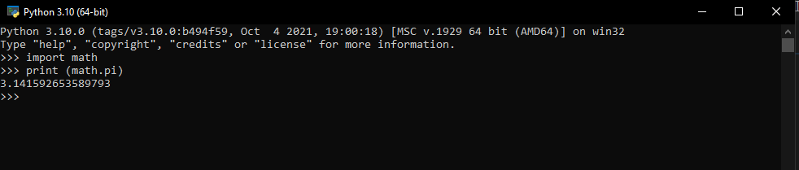
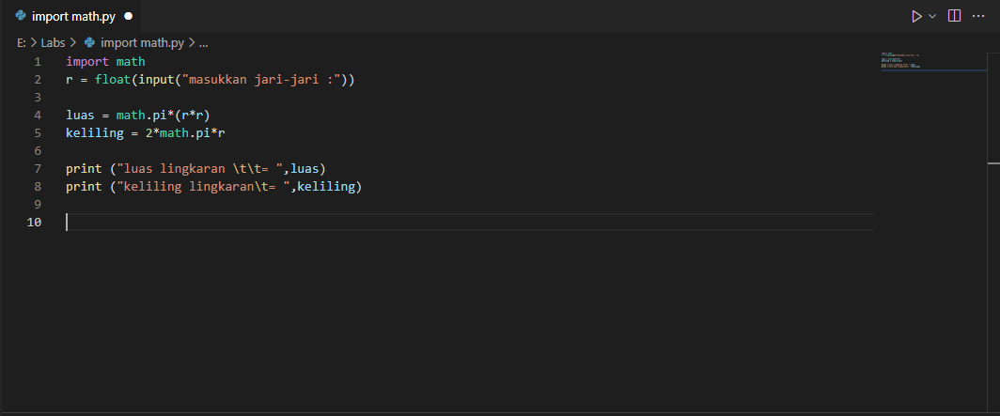
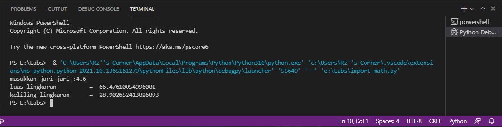
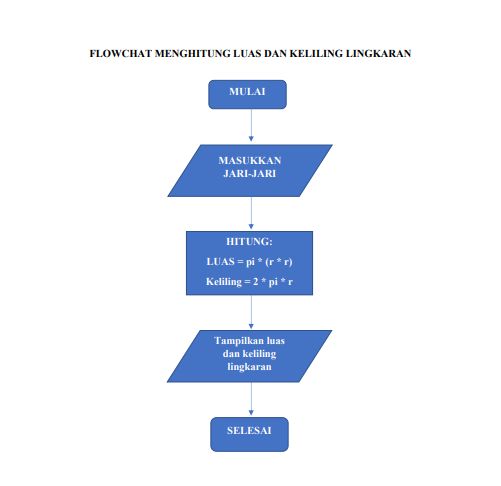

# math_py
## Belajar membuat program matematika menghitung luas dan keliling lingkaran di python

### contoh program python untuk menghitung luas maupun keliling lingkaran
### berikut rumus luas dan keliling lingkaran

### dengan nilai phi yang kita gunakan adalah 3.14
### saya mengimport modul math yang sudah disediakan oleh python.fungsinya agar kita dapat menyertakan nilai phi yang sudah tersedia dalam modul python dengan perintah math.pi, seperti gambar dibawah ini

### dan program yang kita tulis sebagai berikut ini

### dengan keterangan syntax /t merupakan espace atau untuk membuat tab, agar sama dengan didalam output sejajar dan berjarak.

### hasil dari program yang kita tulis adalah sebagai berikut

### dan dengan flowchart sebagai berikut
